<h1 align="center">Reginald</h1>

	

	<b>Reginald</b> is general productivity application designed for Windows and inspired by <a href="https://www.alfredapp.com/">Alfred</a>.

	

	
	

	
	<a href="">
		
	</a href="https://github.com/giosali/reginald/releases">
	

## **Table of Contents**

    

        
        

            

                &nbsp;&nbsp;&nbsp;&nbsp;&nbsp;&nbsp;&nbsp;&nbsp;
                
            

            

                &nbsp;&nbsp;&nbsp;&nbsp;&nbsp;&nbsp;&nbsp;&nbsp;
                
            

            

                &nbsp;&nbsp;&nbsp;&nbsp;&nbsp;&nbsp;&nbsp;&nbsp;
                
            

            

                &nbsp;&nbsp;&nbsp;&nbsp;&nbsp;&nbsp;&nbsp;&nbsp;
                
            

            

                &nbsp;&nbsp;&nbsp;&nbsp;&nbsp;&nbsp;&nbsp;&nbsp;
                
            

            

                &nbsp;&nbsp;&nbsp;&nbsp;&nbsp;&nbsp;&nbsp;&nbsp;
                
            

            

                &nbsp;&nbsp;&nbsp;&nbsp;&nbsp;&nbsp;&nbsp;&nbsp;
                
            
  
            

                &nbsp;&nbsp;&nbsp;&nbsp;&nbsp;&nbsp;&nbsp;&nbsp;
                
            

            

                &nbsp;&nbsp;&nbsp;&nbsp;&nbsp;&nbsp;&nbsp;&nbsp;
                
            

            

                &nbsp;&nbsp;&nbsp;&nbsp;&nbsp;&nbsp;&nbsp;&nbsp;
                
            

            

                &nbsp;&nbsp;&nbsp;&nbsp;&nbsp;&nbsp;&nbsp;&nbsp;
                
            

        

    

    

        
        

            

                &nbsp;&nbsp;&nbsp;&nbsp;&nbsp;&nbsp;&nbsp;&nbsp;
                
            

            

                &nbsp;&nbsp;&nbsp;&nbsp;&nbsp;&nbsp;&nbsp;&nbsp;
                
            

        

    

    

        
        

            

                &nbsp;&nbsp;&nbsp;&nbsp;&nbsp;&nbsp;&nbsp;&nbsp;
                
            

            

                &nbsp;&nbsp;&nbsp;&nbsp;&nbsp;&nbsp;&nbsp;&nbsp;
                
            

        

    

    

        
    

## **Features**

### **Application Launcher**

**Reginald** can help you find and launch your applications quickly and effortlessly. Press <kbd>Alt</kbd> + <kbd>Space</kbd> to open the **Reginald** search window and type away.

	

> __Note__
>
> Don't like using that key binding? No problem. You can always change it to something more to your liking by going to `Settings` **→** `General`.

> __Note__
>
> You can run applications as administrator by pressing <kbd>Alt</kbd> + <kbd>Enter</kbd>.

### **File Search**

Looking for a file? You can instantly search through files in your user directory by pressing <kbd>'</kbd> or <kbd>Space</kbd> when the search window is empty.

    

> __Note__
>
> **Reginald** ignores all files and directories that begin with a period.

### **Calculator**

Need to work out some quick math? Let **Reginald** take care of that for you by freely typing expressions into the search box.

	

Hitting the <kbd>Enter</kbd> key will copy the result to your clipboard. Additionally, holding down the <kbd>Alt</kbd> key will add decimal separators to the result to improve readability.

> __Note__
>
> Depending on your system locale, Reginald's calculator could use either points (.) or commas (,) as decimal separators and thousands separators.
>
> This can be changed in `Settings` **→** `Features` **→** `Calculator`.

**Reginald** supports solving math expressions that contain the following operators:

[-Parentheses-gray?style=social)]()  
  
  
  
  
  

### **Web Queries**

Never experience the hassle of having to open your web browser *and* open a new tab just to look something up again. With **Reginald**, you can quickly open websites or make web searches with ease through **web queries**.

	

**Reginald** comes outfitted with several handy web queries that you can use out of the box:

| Name \| Keyword | Description |
| :-------------- | :---------- |
|  | Search Amazon for '...' |
|  | Search DuckDuckGo for '...' |
|  | Search eBay for '...' |
|  | Search Facebook for '...' |
|  | Search GitHub for '...' |
|  | Search Google for '...' |
|  | Search IMDb for '...' |
|  | Go to _'s profile |
|  | Search Pinterest for '...' |
|  | Go to r/ |
|  | Go to _'s profile |
|  | Search TikTok for '...' |
|  | Go to _'s blog |
|  | Search tumblr for '...' |
|  | Go to _'s channel |
|  | Go to _'s profile |
|  | Search Twitter for '...' |
|  | Search Wikipedia for '...' |
|  | Search YouTube for '...' |

**Not satisified with some of these**? No worries. You can always disable the ones you don't want to see in your search results. Alternatively, if you don't want any of them, you can toggle them entirely in `Settings` **→** `Features` **→** `Web Queries`.

    

**Wish there were more**? Create your own web queries by going to `Settings` **→** `Features` **→** `Your Web Queries`.

    

### **Clipboard Manager**

**Reginald** features a built-in clipboard manager, allowing you to quickly preview and access text and images that you've previously copied. The clipboard manager can be called by pressing <kbd>Shift</kbd> + <kbd>Alt</kbd> + <kbd>V</kbd>. Like the hotkey for the search window, this can be rebound to another key gesture in `Settings` **→** `Features` **→** `Clipboard Manager`.

    

Whenever you need to remove a clipboard item, you can simply right-click on a clipboard item and click `Delete` in the context menu that appears.

Alternatively, the clipboard manager comes with a keyword: `clear clipboard`. This will empty the entire clipboard manager.

### **Text Expansions**

Text expansions allow you to save time by preventing you from repeatedly typing the same text over and over. When the text you type matches a ***trigger***, that text will be replaced by ***replacement*** text designated by you.

To get started, go to `Settings` **→** `Features` **→** `Expansions`. This is where you can view your text expansions, edit your expansions, and create new text expansions. 

> __Note__
>
> Triggers are case-sensitive and can contain symbols and numbers.

### **URLs**

Got a URL on hand? Paste it into **Reginald**'s search window and press <kbd>Enter</kbd> to open it in your default web browser.

    

### **Timer**

If you ever need to be reminded of something, just have **Reginald** set a timer for you. You can set a timer for 30 seconds, 5 minutes, an hour, etc. After the timer stops, a toast notification will be pushed to your screen.

```mermaid
flowchart TD
    A("Timer"):::darkorange --> B("🔑<br>timer"):::gray
    A --> C("🔎<br>Creates a timer"):::gray
    A --> D("🔗<br>Click here<br>for more information"):::gray

    click D "https://github.com/giosali/reginald/wiki#clear-clipboard" "Open this in a new tab" _blank

    classDef darkorange color:white,fill:darkorange,stroke:darkorange;
    classDef gray color:white,fill:gray,stroke:gray;
```

    

To look at your all of your currently active timers, type the keyword `timers` into **Reginald**'s search box.

### **Recycle Bin**

Emptying your PC's Recycle Bin has never been easier. Type `empty recycle bin` into **Reginald**'s search box and simple press <kbd>Enter</kbd> (*twice* actually, **Reginald** will ask for confirmation first).

### **Quit Applications**

In addition to launching applications, **Reginald** can also exit applications for you as well. Typing `quit` will display applications that currently have a top-level window. Pressing <kbd>Enter</kbd> will cause those applications to quit.

Have an application that froze on you? Use the `forcequit` keyword to forcibly terminate any locked application.

```mermaid
flowchart TD
    A("Quit"):::darkorange --> B("🔑<br>forcequit"):::gray
    A --> C("🔎<br>Force quits an application"):::gray
    A --> D("🔗<br>Click here<br>for more information"):::gray

    click D "https://github.com/giosali/reginald/wiki#forcequit" "Open this in a new tab" _blank

    classDef darkorange color:white,fill:darkorange,stroke:darkorange;
    classDef gray color:white,fill:gray,stroke:gray;
```

> __Warning__
>
> The `forcequit` keyword will **not** prompt you to save any unsaved progress.

### **Microsoft Settings**

Stop tirelessly searching through Microsoft's settings application to no avail. With **Reginald**, you can swiftly sift through `ms-settings` URI pages. You can read more about those pages [through documentation by Microsoft](https://docs.microsoft.com/windows/uwp/launch-resume/launch-settings-app).

> __Note__
>
> Microsoft settings will only appear after the input you've typed is equal to or longer than 3 characters.

## **QOL Features**

### **CTRL + T**

When either the main search window or the clipboard manager window is open, you can press <kbd>Ctrl</kbd> + <kbd>T</kbd> to make the window semi-transparent. This can be extremely useful for viewing content obscured by the window. You can toggle off the effect by pressing <kbd>Ctrl</kbd> + <kbd>T</kbd> again or by closing the window.

    

### **Alt Key**

```mermaid
flowchart LR
    A("🔑 Alt"):::darkorange --> B("Application"):::gray --> C("Displays prompt<br>to run as administrator") --> D("🔑 Enter"):::darkorange --> E("Runs application<br>as administrator")
    A --> F("Web Query"):::gray --> G("<i>Optional</i><br>Displays additional URL info") --> H("🔑 Enter"):::darkorange --> I("<i>Optional</i><br>Launches additional URL")
    A --> J("Calculator"):::gray --> K("Adds thousands separator")
    A --> L("Timers"):::gray --> M("Displays prompt to cancel timer") --> N("🔑 Enter"):::darkorange --> O("Cancels and removes timer")

    classDef darkorange color:white,fill:darkorange,stroke:darkorange;
    classDef gray color:white,fill:gray,stroke:gray;
```

Many search results have the option of displaying additional information or providing additional functionality when holding down the <kbd>Alt</kbd> key.

## **Installation**

### **Releases**

In order to install **Reginald**, head over to the [Releases](https://github.com/giosali/reginald/releases) section of the repository and within the latest release, you'll be able to find the installer file under `Assets`. The name of the installer file should look similar to `Reginald-x.x.x.msi`. 

> __Note__
>
> The same installer file works for both Windows 10 and Windows 11.

Once you've downloaded the installer, open it and follow the installer's instructions. After that, you're all set.

### **Microsoft Defender Smartscreen**

Unfortunately, **Reginald** doesn't currently have a code signing certificate because they're expensive and this application is **free** and **open-source**. As a result, there's a chance you might run into the following message when attempting to install **Reginald**:

	

This is [Microsoft Defender Smartscreen](https://en.wikipedia.org/wiki/Microsoft_SmartScreen). It's easy to get around it, however. All you need to do is:

1. Click on `More info` in the Smartscreen window
2. And then click on `Run anyway`

Once you do that, you should be able to install **Reginald**.

> __Note__
>
> The more people who use this application, the more likely future users won't receive the Smartscreen message. So, if you've tried **Reginald** and continue to keep him on your PC, thank you.

## **Issues and Suggestions**

If you happen to have any problems or ideas to improve **Reginald**, please don't hesitate to [file an issue](https://github.com/giosali/reginald/issues/new)!
